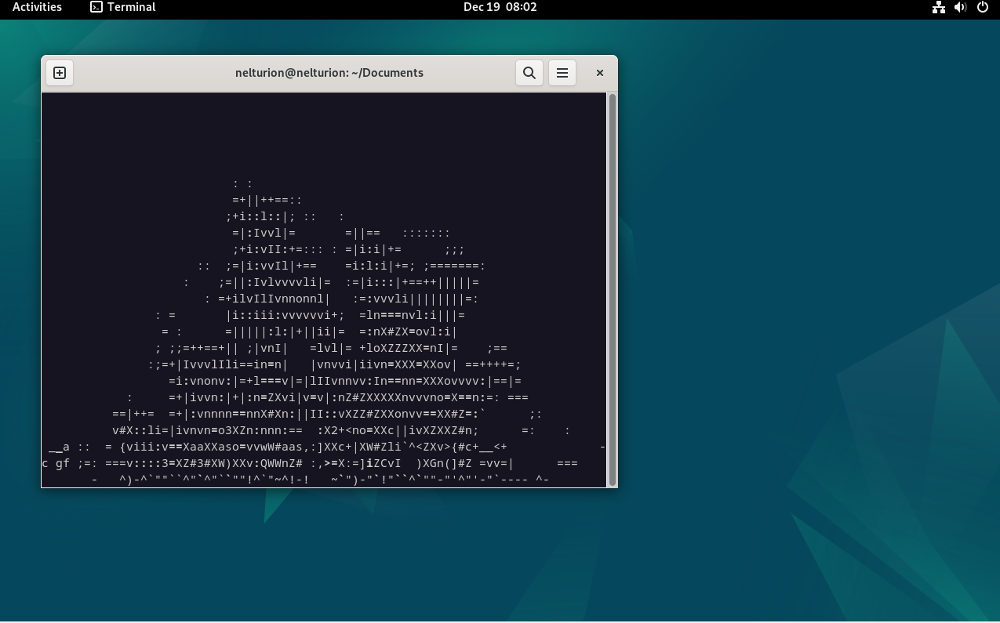
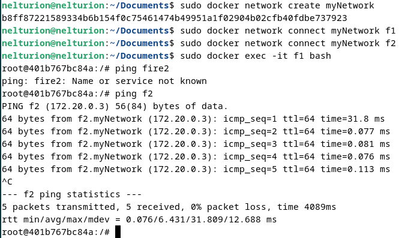
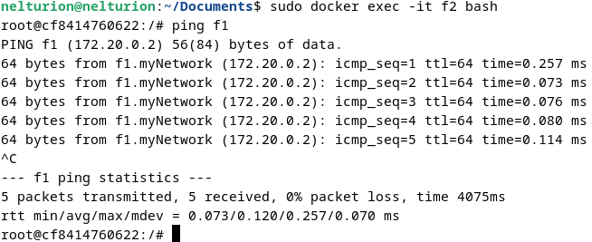

# Лабораторная работа №4

## Тема: контейнеризация через Docker

## Цель работы:

Настроить докер; создать два контейнера; соединить их в одну сеть; проверить связь

## Ход работы

1) создал Dockerfile
```bash
cd ~/Documents
touch Dockerfile
```

2) изменил его содержимое с помощью команды 
```bash
nano Dockerfile
```
на 
```docker
FROM ubuntu:latest
RUN apt-get update && apt-get install -y libaa-bin && apt-get install -y iputils-ping \ 
&& apt-install -y libcap2-bin && apt-install -y libpam-cap
ENTRYPOINT bash
```

и конечно же собрал и запустил его:
```bash
sudo docker build .
```


### Настройка сети
3) запускаем два контейнера
```bash
sudo docker run -d --name f1 aafire sleep infinity
sudo docker run -d --name f1 aafire sleep infinity
```
4) проверяем, что они запустились с помощью команды
```bash
sudo docker ps
```

5) создаем сеть и подключаем в нее работающие контейнеры
```bash
docker network create myNetwork
docker network connect myNetwork f1
docker network connect myNetwork f2
```
6) заходим в оболочку контейнеров и проверяем, что они видят друг друга в этой сети
```bash
sudo docker exec -it f1 bash
```
```bash
ping f2
```



аналогично со вторым контейнером:
```bash
sudo docker exec -it f2 bash
```
```bash
ping f1
```


